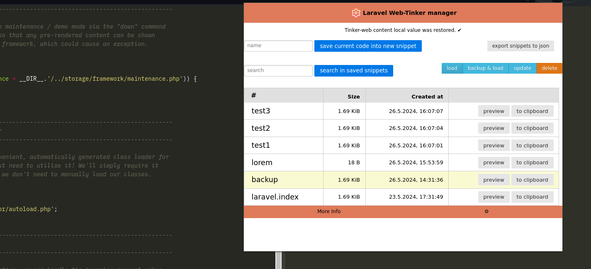

# Laravel web-tinker manager

This extension helps you manage code for all of your Laravel web-tinker code! 

Save/restore/organize/search your code!

## Features
  - isolates your saved snippets **per-domain**
  - save current tinker content (with name)
  - preview saved code (with syntax highlighting provided by [highlightjs](https://highlightjs.org/))
  - search in saved snippets
  - restore saved code
  - download your snippets in .json format

## Incoming features
  - restore snippets from .json file
  - copy/paste snippets between domains
  - better UI :)
  - settings
  - ...

## How to install
  - clone this repo locally
  - in chrome://extensions (or brave://extensions) enable "Developer mode"
  - "Load unpacked" > select the local extension folder
  - enjoy!

## Required permissions
  - scripting 
  - activeTab
  - tabs
  - storage